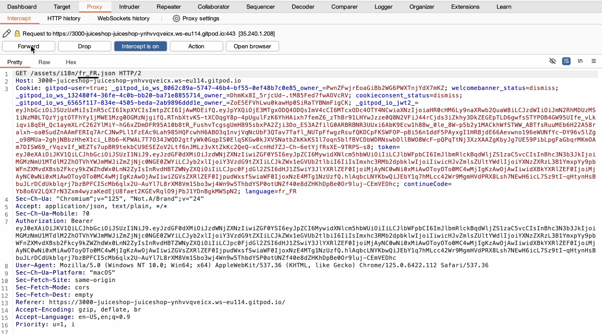

# Cybersecurity OSWAP Juice Shop Report
## Introduction

In this demo, I chose to use OSWAP Juice Shop as a target to experiment with Burp and other tools by doing the offered challenges. Initially, I tried to solve the challenges on my own by thinking about the solutions I thought about how to solve the challenges, but I had to use online tutorials to help me with the technical part.

This report is organized in:
- Challenges name followed by the description and the solution.
- The order of the challenges in the report corresponds to the order of the challenges in the demo.
- The tools I used for writing the report and building the demo are listed at the end of the page.

To be noticed that:
- The Audio in the demo was added after the edit of the video.
- The demo was edited and there are scenes that were cut in which there were the trials to solve the challenge.
- The work in the demo wasn’t done entirely by me since I watched the online tutorials (but I tried and got to some solutions but couldn’t do the technical part).

## Challenges from the Score Board

### Change Bender's Password

**Description**: Change Bender's password into slurmCIssic without using SQL Injection or Forgot Password.

**Solution**: To solve this challenge, I first identified the target’s email by analyzing the reviews. Using SQL injection, I was able to log in. Then by inspecting the password change request with Burp, I removed the "current password" field and forwarded the request. Due to OWASP's vulnerability, this method successfully bypassed the password change requirement.

### Extra Language

**Description**: Retrieve the language file that never made it into production.

**Solution**: To retrieve the missing language on the platform, analyze and compare the available languages with those found online. By using Burp to observe how the language is specified in the request, then inject the code for the missing language into a request. This method allows you to identify and retrieve the unsupported language by understanding and modifying the request structure.

### Leaked Access Logs

**Description**: Dumpster over the Internet for a leaked password and log in to the original user account it belongs to. (Creating a new account with the same password does not qualify as a solution.)

**Solution**: By finding the leaked password online and decoding it with Burp's decoder, you can then test this password against each email address obtained from the admin page (accessible via SQL injection). This method helps you identify the specific email account associated with the password, enabling a successful login.

### Reset Bjoern’s Password

**Description**: Reset the password of Bjeorn’s internal account via Forget Password mechanism with the original answer to the security question.

**Solution**: To obtain Bjorn’s email, first access the admin page as done previously with Bender. Then go to the 'forgot password' section. His security question was displayed in plain text, making it easy to find the answer online. Using this information, you can reset his password.

### Reset Morty’s Password

**Description**: Reset the password of Bjeorn’s internal account via Forget Password mechanism with his obfuscated answer to the question.

**Solution**: Following the same approach as with Bjoern, Morty's security question was "What is his favorite pet’s name?". Solving this required knowledge of the "Rick and Morty" series to identify the answer as Snowball. However, since the answer was obfuscated, I used Burp's Intruder tool for character substitution to test all possible letter and number combinations. This process eventually allowed me to correctly answer the security question and resetting the password.

### Unsigned JWT

**Description**: Forge an essentially unsigned JWT token that impersonates the (non-existing) user jwtn3d@juice-sh.op.

**Solution**: To forge the JWT token, start by obtaining a valid one. Log in with any account and perform an action like viewing the cart. Using Burp, analyze the request to find the Authorization token. Decode it using an online JWT decoder. Change the "alg" field to "none" (since it's unsigned) and the "email" field to the email specified in the challenge. Re-encode the token, then replace the original Authorization token with the new one in your logged-in session.

## Tools Used

### Burp

Burp Suite is a comprehensive toolset used for web application security testing. It includes features like a proxy server to intercept and modify HTTP requests, a scanner to identify vulnerabilities, and various utilities for web application analysis and penetration testing. Burp Suite is widely used by security professionals to perform tasks such as finding security flaws, exploiting vulnerabilities, and conducting penetration tests on web applications. I used it in the whole experiment to analyze and manipulate the traffic.

### StackOverflow

Stack Overflow is a popular online community and Q&A platform for programmers. It allows users to ask and answer questions related to coding, software development, and other technical topics. Users can vote on questions and answers, which helps highlight the most useful responses. Stack Overflow is part of the Stack Exchange network, which hosts a variety of Q&A sites on diverse subjects. It is widely used by developers to seek help, share knowledge, and collaborate on programming issues. I used it to get the leaked password for one of the challenges.

### jwt.io

JWT.io is an online tool for decoding, verifying, and generating JSON Web Tokens (JWT). It allows users to paste a JWT and view its header, payload, and signature. The site provides libraries for various programming languages to help integrate JWT authentication into applications. JWT.io is widely used by developers to troubleshoot and understand JWTs, ensuring secure token-based authentication in their projects. Used it to decode the token for the Unsigned JWT challenges.

### Base64.Guru

Base64.Guru is an online resource and tool that provides comprehensive information and utilities for encoding and decoding Base64, including its URL-safe variant Base64Url. It offers explanations, examples, and interactive tools to encode or decode Base64 strings, helping users understand and work with Base64 in various applications such as data transmission, cryptography, and web development. I used it to encode the token in the unsigned JWT token.

### QuickTime Player

QuickTime Player is a multimedia application developed by Apple Inc. It allows users to play, record, edit, and share audio and video files. The player supports a wide range of media formats, including MOV, MP4, and MP3. It is available for macOS and was previously available for Windows. QuickTime Player also provides features like screen recording and simple video editing capabilities, making it a versatile tool for handling multimedia content. I used it to screen record the whole experiment.

### iMovie

iMovie is a video editing software application developed by Apple Inc. for macOS and iOS devices. It provides an easy-to-use interface for creating and editing videos, allowing users to import video clips, photos, and audio, apply transitions, effects, and titles, and export finished movies in various formats. iMovie supports 4K video resolution, green screen effects, and has a variety of templates and themes for quick video creation. It is suitable for both beginners and more experienced users looking for a simple yet powerful video editing tool. Used it for the demo editing.

### ChatGPT
ChatGPT is a conversational AI model developed by OpenAI. It's based on the GPT (Generative Pre-trained Transformer) architecture, which is designed to understand and generate human-like text based on the input it receives. I used it to help in the Markdown language and to adjust some of my writings.

### Tutorial

[Tutorial](https://www.youtube.com/watch?v=y12QNP2pWN0). Used this tutorial as a guide for the technical part.

